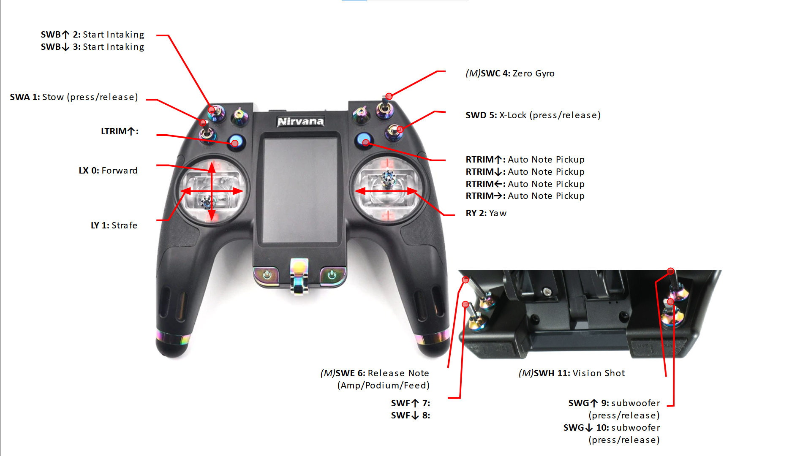

# 2024 FIRST CRESCENDO

## Controls

### Driver Controller

### Operator Controller

## CAN Bus

| Subsystem | Type     | Talon      | ID  | Comp PDP | Proto PDP | Motor   | Breaker | CAN Bus  |
| --------- | -------- | ---------- | --- | -------- | --------- | ------- | ------- | -------- |
| Drive     | SRX      | azimuth    | 0   |  16      | 16        | 9015    |         | rio      |
| Drive     | SRX      | azimuth    | 1   |  3       | 2         | 9015    |         | rio      |
| Drive     | SRX      | azimuth    | 2   |  17      | 17        | 9015    |         | rio      |
| Drive     | SRX      | azimuth    | 3   |  2       | 4         | 9015    |         | rio      |
| Drive     | FX       | drive      | 10  |  18      | 18        | kraken  |         | rio      |
| Drive     | FX       | drive      | 11  |  1       | 1         | kraken  |         | rio      |
| Drive     | FX       | drive      | 12  |  19      | 19        | kraken  |         | rio      |
| Drive     | FX       | drive      | 13  |  0       | 0         | kraken  |         | rio      |
| Intake    | FX       | intake     | 20  |  5       | 3         | falcon  |         | rio      |
| Magazine  | FX       | magazine   | 25  |  10      | 13        | falcon  |         | rio      |
| Elbow     | FX       | elbow      | 30  |  6       | 5         | falcon  |         | canivore |
| Elbow     | CANcoder | cancoder   | 31  |          |           | -       |         | rio      |
| Elbow     | CANcoder | highRes    | 32  |          |           | -       |         | canivore |
| Wrist     | SRX      | wrist      | 35  |  11      | 11        | 9015    |         | rio      |
| Shooter   | FX       | leftShoot  | 40  |  12      | 12        | falcon  |         | rio      |
| Shooter   | FX       | rightShoot | 41  |  13      | 10        | falcon  |         | rio      |
| Climb     | FX       | leftClimb  | 50  |  15      |           | falcon  |         | rio      |
| Climb     | FX       | rightClimb | 51  |  4       |           | falcon  |         | rio      |
| Climb     | SRX      | leftFork   | 52  | 7        |           | johnson |         | rio      |
| Climb     | SRX      | rightFork  | 53  | 8        |           | johnson |         | rio      |
| -         | rio      | -          | -   | 20       |           | -       |         | rio      |
| coder/sw  | vrm      | top        | -   | 21       |           | -       |         | -        |
| radio     | vrm      | bottom     | -   | 22       |           | -       |         | -        |

* intake beam break: to wheel 1 azimuth fwd lim
* magazine upper beam break: to magazine rev lim
* magazine lower beam break: to magazine fwd lim

## Roborio
| Subsystem | Interface | Device     | 
| --------- | --------- | ---------- |
| Elbow     | USB       | CANivore   |

## DIO
| Subsystem | name           | ID  |
| --------- | -------------- | --- |
| Auto      | autoSwitch     | 0   |
| Auto      | autoSwitch     | 1   |
| Auto      | autoSwitch     | 2   |
| Auto      | autoSwitch     | 3   |
| Auto      | autoSwitch     | 4   |
| Auto      | autoSwitch     | 5   |
| Robot     | eventInterlock | 6   |
|           |                | 7   |
|           |                | 8   |
|           |                | 9   | 

## PWM
| Subsystem | name         | ID  |
| --------- | ------------ | --- |
|           |              | 0   |
|           |              | 1   |
|           |              | 2   |
|           |              | 3   |
| Lights    | lights       | 4   |
|           |              | 5   |
|           |              | 6   |
|           |              | 7   |
|           |              | 8   |
|           |              | 9   |

## MXP
| Subsystem | name   | ID |
| --------- | ------ | -- |
|           |        |    |

## Analog
| Subsystem  | name      | ID |
| ---------- | --------- | -- |
| RobotState | tempSense | 0  |

