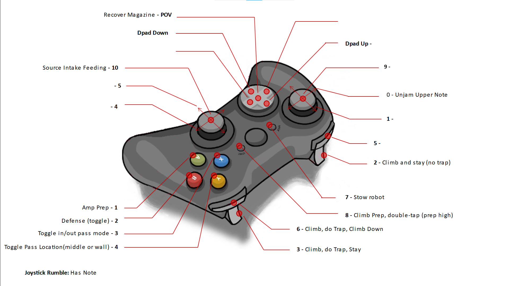

# 2024 FIRST CRESCENDO

## Controls

### Driver Controller

### Operator Controller

## CAN Bus

| Subsystem | Type     | Talon      | ID  | Comp PDP | Proto PDP | Motor  | Breaker |
| --------- | -------- | ---------- | --- | -------- | --------- | ------ | ------- |
| Drive     | SRX      | azimuth    | 0   |          | 16        | 9015   |         |
| Drive     | SRX      | azimuth    | 1   |          | 2         | 9015   |         |
| Drive     | SRX      | azimuth    | 2   |          | 17        | 9015   |         |
| Drive     | SRX      | azimuth    | 3   |          | 4         | 9015   |         |
| Drive     | FX       | drive      | 10  |          | 18        | kraken |         |
| Drive     | FX       | drive      | 11  |          | 1         | kraken |         |
| Drive     | FX       | drive      | 12  |          | 19        | kraken |         |
| Drive     | FX       | drive      | 13  |          | 0         | kraken |         |
| Intake    | FX       | intake     | 20  |          | 3         | falcon |         |
| Magazine  | FX       | magazine   | 25  |          | 13        | falcon |         |
| Elbow     | FX       | elbow      | 30  |          | 5         | falcon |         |
| Elbow     | CANcoder | cancoder   | 31  |          |           | -      |         |
| Wrist     | SRX      | wrist      | 35  |          | 11        | 9015   |         |
| Shooter   | FX       | leftShoot  | 40  |          | 12        | falcon |         |
| Shooter   | FX       | rightShoot | 41  |          | 10        | falcon |         |
| Climb     | FX       | climb      | 50  |          |           | falcon |         |
| -         | rio      | -          | -   | 20       |           |        |         |
| coder/sw  | vrm      | top        | -   | 21       |           |        |         |
| radio     | vrm      | bottom     | -   | 22       |           |        |         |

* intake beam break: to wheel 1 azimuth fwd lim
* magazine y-axis beam break: to wrist fwd lim
* magazine z-axis beam break: to wrist rev lim
*abs encoder for elbow to canifier

## Roborio
| Subsystem | Interface | Device | 
| --------- | --------- | ------ |
| Drive     | USB       | NAVX   |

## DIO
| Subsystem | name           | ID  |
| --------- | -------------- | --- |
| Auto      | autoSwitch     | 0   |
| Auto      | autoSwitch     | 1   |
| Auto      | autoSwitch     | 2   |
| Auto      | autoSwitch     | 3   |
| Auto      | autoSwitch     | 4   |
| Auto      | autoSwitch     | 5   |
| Robot     | eventInterlock | 6   |
|           |                | 7   |
|           |                | 8   |
|           |                | 9   |

## MXP
| Subsystem | name   | ID |
| --------- | ------ | -- |
|           |        |    |

