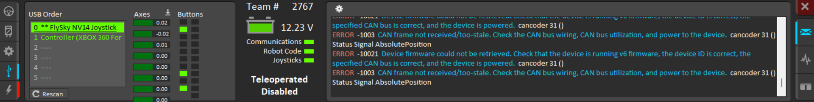
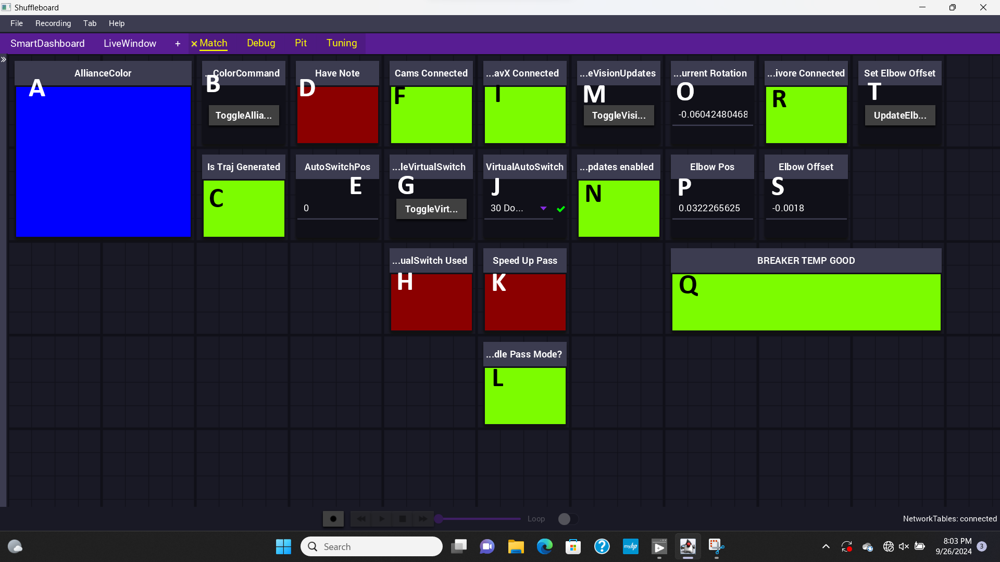
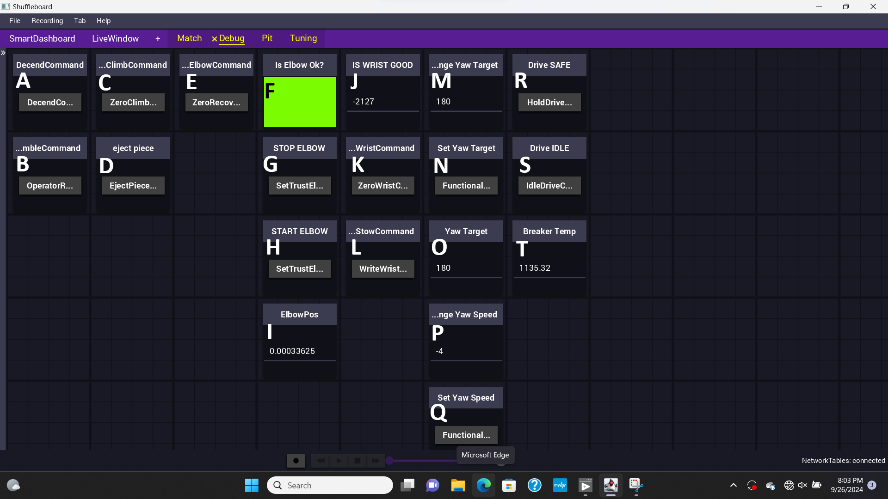
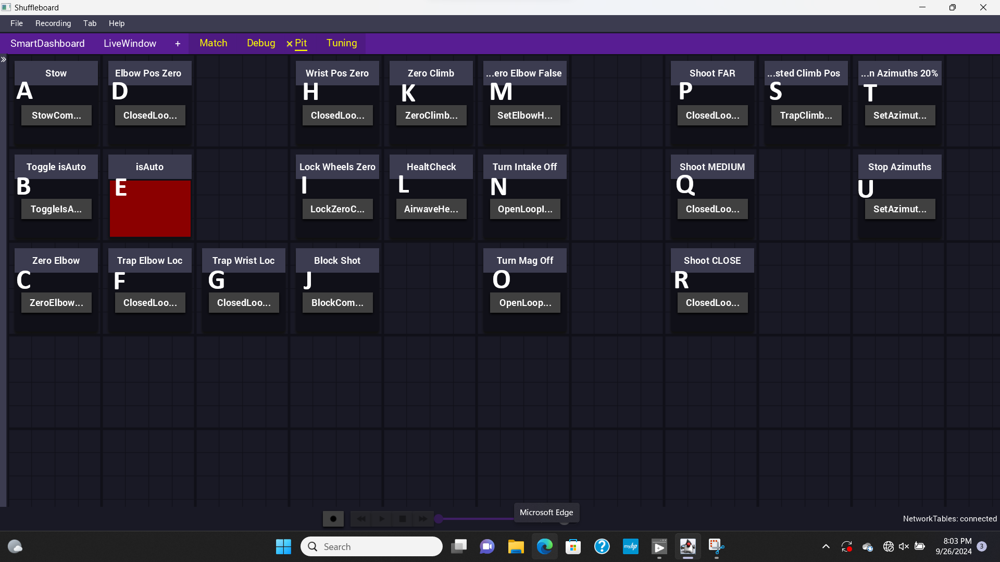

## Pre Match Checks

### Joystick Checks
- [ ] Set up controllers on correct side for that driver station position (based on drive team preferences and match strategy)
- [ ] Ensure flysky joystick is powered on
- [ ] Check that driver joystick (flysky) is recognized on port 0 (wiggle sticks to ensure they are updating)
- [ ] Check that operator joystick (xbox) is recognized on port 1 (wiggle sticks/buttons to ensure they are updating)

### Dashboard Checks
Wait for Connection between driver station and field, then check the below items
#### Match Tab
- [ ] Ensure correct auto # shows in auto switch pos (E)
- [ ] Ensure cameras connected boolean is green - have to power cycle robot if this doesn't happen (F)
- [ ] Ensure canivore connected boolean is green - have to power cycle robot if this doesn't happen (R)
- [ ] Ensure vision updates enabled boolean is green (N)
- [ ] Ensure navx current rotation is updating - have to power cycle robot if this doesn't happen (O)
- [ ] Ensure elbow position is updating - have to power cycle robot if this doesn't happen (P)
- [ ] Make sure alliance color is correct (if it already looks correct, change it away from current and change back to correct) (A,B)
- [ ] Ensure trajectory generated is green (C)
- [ ] Ensure elbow offset matches current offset # (S)

#### Debug Tab
- [ ] Press operator rumble button, ensure operator joystick rumbles (B)
- [ ] Check that wrist position is close to 2000 - if not tell Cory that wrist won't work for this match (J)

### General Checks
- [ ] if set static ip in pits - make sure this is set back (won't connect to the field)

## Pit Checks

### Health Check
- [ ] Ensure robot is in stow position (usually we turn off intake/mag as well) (back button on operator controller,N,O)
- [ ] Press health check button and wait for test to complete (ensure no one sticks body parts in robot during test) (L)
- [ ] Zero climb and check wheels locked to zero (I,K)
- [ ] Disable robot
- [ ] Pull health check data on grapher computer
- [ ] Review graphs to ensure everything looks normal

### Log Files
- [ ] Use winscp to connect to the robot
- [ ] Copy over log files to a designated folder for that competition
- [ ] Delete log files on robot (ensures lots of free space, only do this after copying all necessary logs)

### General
- [ ] When pit crew are lubricating swerve, turn azimuths on using button on pit dashboard (T,U on Pit Tab)
